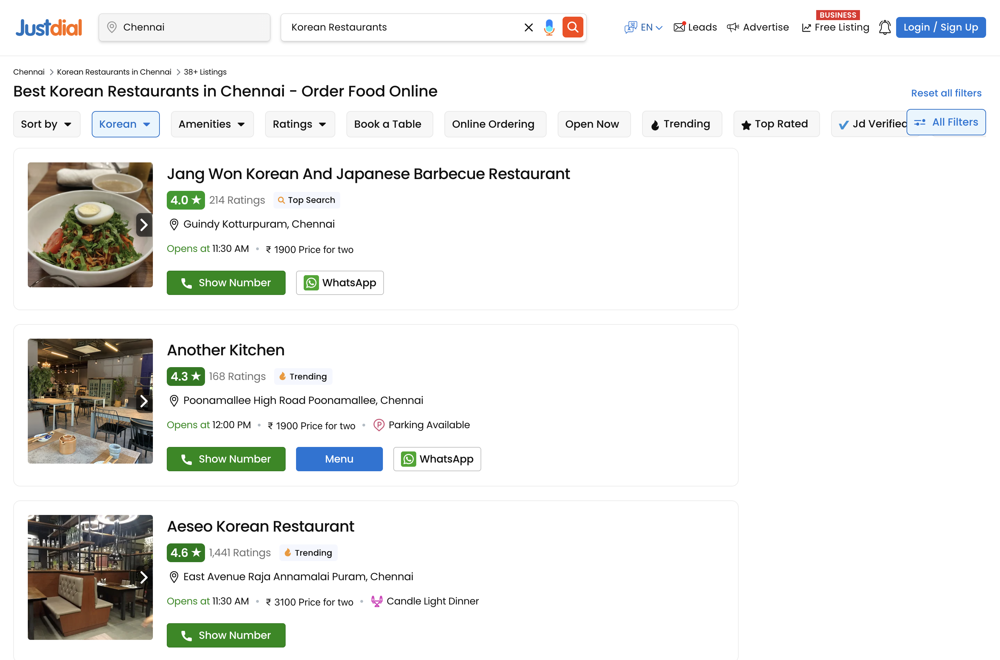
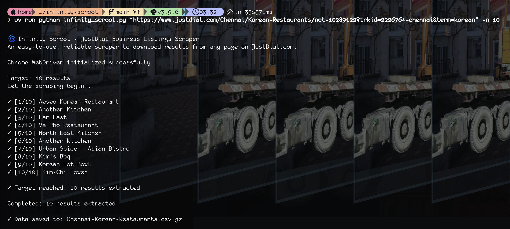
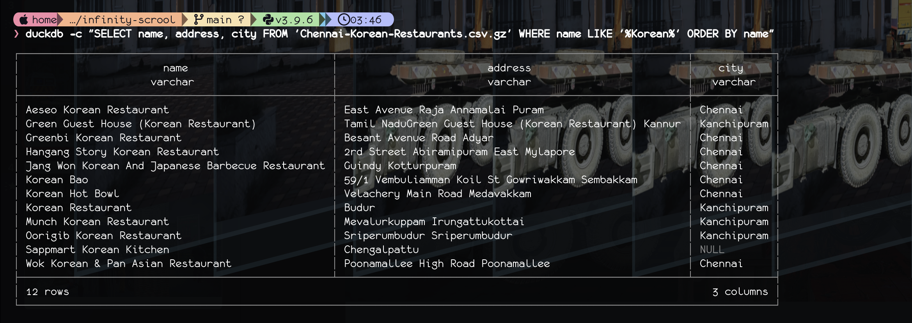

# Infinity Scrool — JustDial Business Listings Scraper

JustDial provides a comprehensive, well‑organized directory with rich filters and up‑to‑date listings of possibly every business across every city and town in India.

`infinity-scrool.py` is an easy-to-use, reliable, lightweight program to download and save business listings from any page on JustDial.com.

- **Ultra‑light output**: Writes compact `.csv.gz` files you can share or load into any analytical tool
- **Fresh data**: Every time the program is run, it grows the dataset with new listings and updates old listings
- **Gentle scraping**: Human‑like scrolling to reduce bot detection

## Quick start

- **Prerequisites**
  - Python 3.9+
  - Google Chrome installed

- **Create and activate a virtual environment**
  ```bash
  ↪ python -m venv .venv
  ↪ source .venv/bin/activate  # Windows: .venv\Scripts\activate
  ```

- **Install dependencies**
  ```bash
  ↪ pip install -r requirements.txt
  ```

## Usage

- Basic usage: Scrape 50 results by default

    ```python
    ↪ python infinity_scrool.py "https://www.justdial.com/Bangalore/Pg-Accommodations/"
    ```

- Get more results

    ```python
    ↪ python infinity_scrool.py "https://www.justdial.com/Bangalore/Pg-Accommodations/" -n 150
    ```

- Watch the magic as it happens in a browser window

    ```python
    ↪ python infinity_scrool.py "https://www.justdial.com/Bangalore/Pg-Accommodations/" --no-headless
    ```

- Custom output filename

    ```python
    ↪ python infinity_scrool.py "URL" -n 150 --output my_data
    ```

## Tips

- Results are saved to a CSV file. Filename is determined automatically based on the URL.

- Our bot knows how to work with infinite scroll pages.  

- Scraper mimics human-like scrolling to play nicely with bot blockers.

- Data is deduplicated and appended to existing files. Every time you run the program, you grow the dataset.

- 🦹‍♀️ PRO TIP: Use this tool judiciously. DO NOT OVERDO IT! 

With that said, happy and responsible scraping! ✨✨✨

## Example: Korean restaurants in Chennai

Thanks to the presence of Korean industries in Chennai, there's a fairly large expat community in the city, and in their service, quite a number of Korean restaurants. Let's say you want to try out some authentic Korean food on your upcoming visit to Chennai.

- **Step 1 — Search JustDial.com**

    Run a search on JustDial.com. Copy the url. Don't bother cleaning it.



- **Step 2 — Grab 10 results**

  ```bash
  ↪ python infinity_scrool.py "https://www.justdial.com/Chennai/Korean-Restaurants/nct-10289122?trkId=2226764-chennai&term=korean" -n 10
  ```

  Automatic output filename: `Chennai-Korean-Restaurants.csv.gz`

  

- **Step 3 — Filter the list (using DuckDB, for instance)**

  ```bash
  ↪ duckdb -c "SELECT name, address, city FROM 'Chennai-Korean-Restaurants.csv.gz' WHERE name LIKE '%Korean%' ORDER BY name"
  ```

  

    Why `.csv.gz` helps:
    - Tiny files, fast downloads and commits
    - Opens directly in Pandas and DuckDB

  ```python
  import pandas as pd
  df = pd.read_csv('Chennai-Korean-Restaurants.csv.gz')
  ```

## Output files and naming

- Filenames are derived from the URL path. Example:
  - `https://www.justdial.com/Bangalore/Pg-Accommodations/...` → `Bangalore-Pg-Accommodations.csv.gz`
- Columns: `datestamp, name, address, city`
- Appends on subsequent runs and removes duplicates by `name + address + city`.

## Safety and etiquette

- **Please scrape responsibly.** Don’t hammer pages. Increase `-n` gradually.
- Headless is on by default; use visible mode only when needed.
- Respect the platform. Credit your source when sharing results.

## Where things live

- Main script: `infinity_scrool.py`
- Data: `*.csv.gz` files in this folder. Open the `.gz` to get a `.csv` file.
- Screenshots used above are in the `docs/` folder.

---

Made for lightweight data collection and quick analysis.
